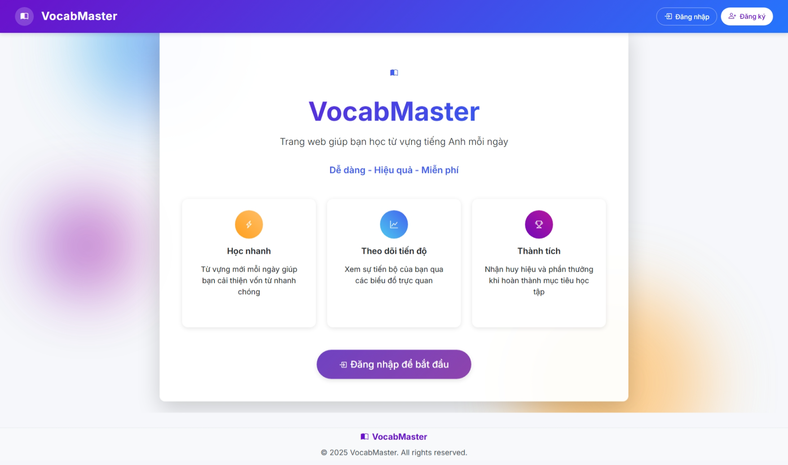
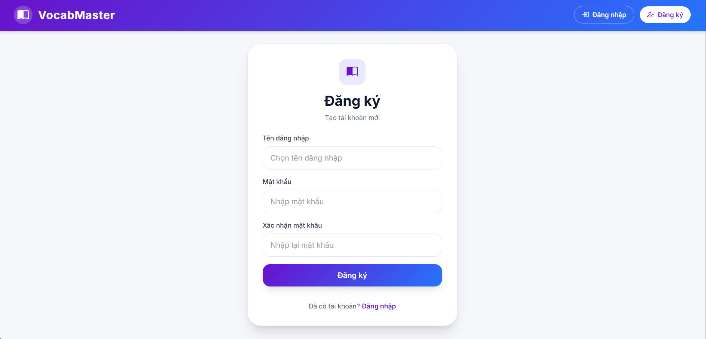
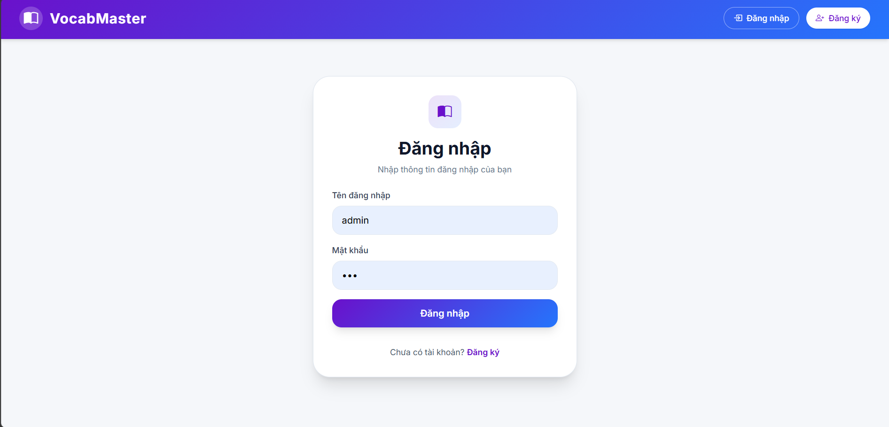
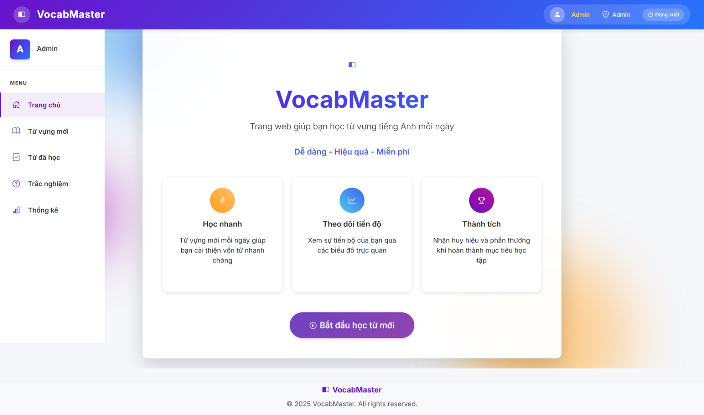
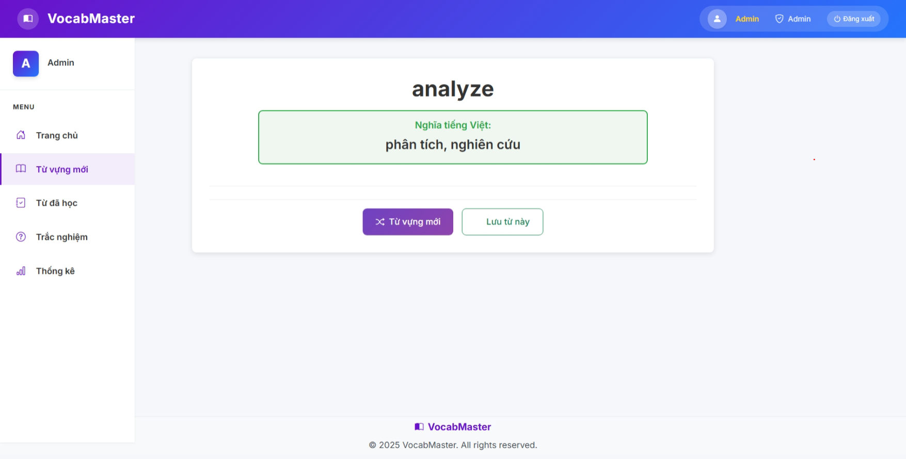
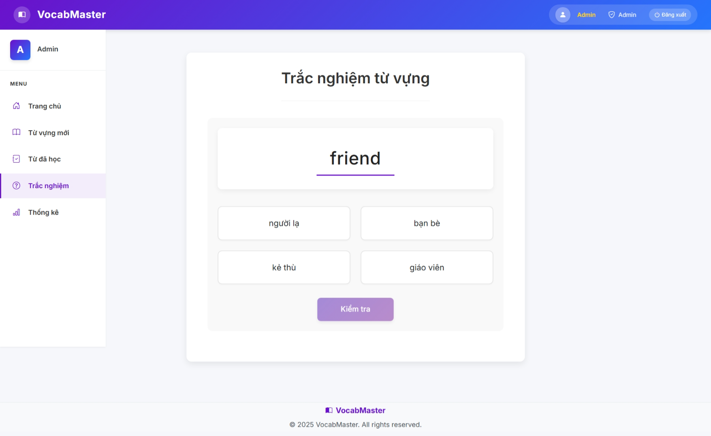
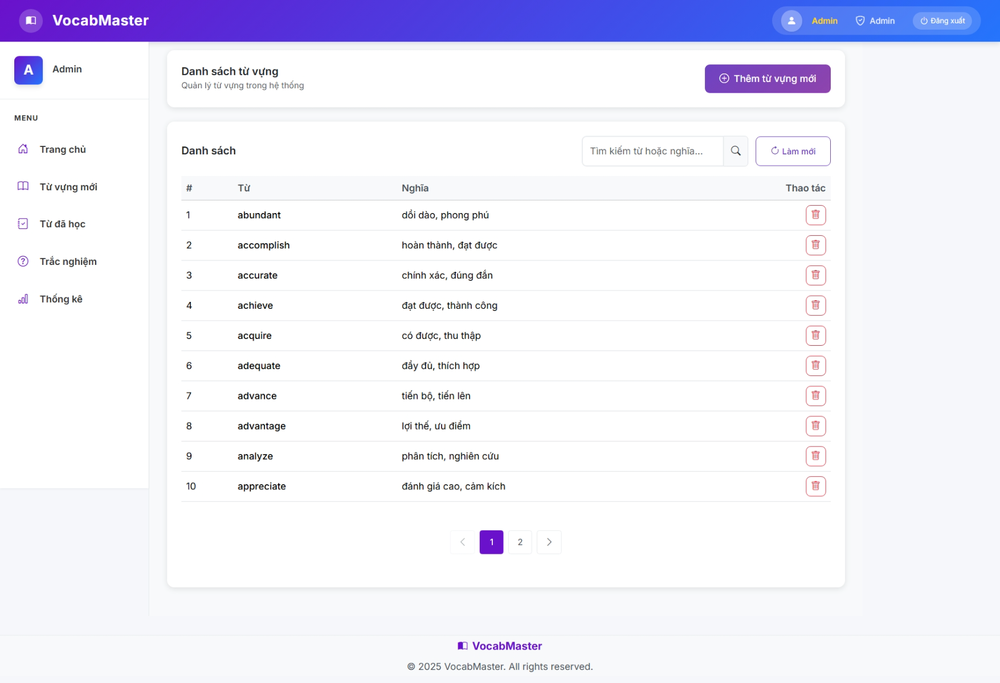

# VocabMaster - Ứng dụng học từ vựng Tiếng Anh

Ứng dụng web giúp học từ vựng tiếng Anh thông qua tra cứu ngẫu nhiên, lưu từ đã học và luyện tập bằng quiz trắc nghiệm.

## Công nghệ sử dụng

| Tầng          | Công nghệ                                            |
| ------------- | ---------------------------------------------------- |
| Frontend      | React 18, TypeScript, Tailwind CSS, React Router v6  |
| Backend       | ASP.NET Core 9 (Web API), Entity Framework Core, JWT |
| Cơ sở dữ liệu | SQL Server 2022                                      |
| Triển khai    | Docker, Docker Compose, Nginx                        |

## Kiến trúc

Backend được tổ chức theo Clean Architecture gồm 4 tầng:

- **Domain** — Entity: `User`, `Vocabulary`, `QuizQuestion`, `LearnedWord`, `CompletedQuiz`
- **Application** — Interface và Service: xác thực, quiz, từ vựng, thống kê
- **Infrastructure** — EF Core DbContext, Repository, JWT, Seeding dữ liệu
- **Api** — Controllers (`Account`, `WordGenerator`, `LearnedWord`, `Quizz`, `QuizzStat`), DTO/Contracts, Middleware

## Chức năng chính

- **Đăng ký / Đăng nhập** — xác thực bằng JWT, tự động refresh token
- **Random từ vựng** — hiển thị ngẫu nhiên 1 từ tiếng Anh kèm nghĩa tiếng Việt và ví dụ
- **Lưu từ vựng** — đánh dấu từ đã học, xem lại danh sách
- **Quiz trắc nghiệm** — câu hỏi 4 lựa chọn, kiểm tra từ vựng đã học
- **Thống kê tiến độ** — theo dõi số từ đã học và kết quả quiz đã hoàn thành

## Chạy bằng Docker

> Yêu cầu: **Docker Desktop** đang chạy.

**Clone repo và chạy toàn bộ stack bằng 1 lệnh:**

```bash
git clone https://github.com/<your-username>/VocabMaster.git
cd VocabMaster
docker compose up --build
```

> Dữ liệu SQL Server được lưu trong Docker volume `mssql-data` — không mất khi restart.

> Lần chạy đầu API tự động chạy migration và seed dữ liệu mẫu (từ vựng + câu hỏi quiz).

> Cấu hình connection string tại `backend/src/VocabMaster.Api/appsettings.json`.

## Demo









